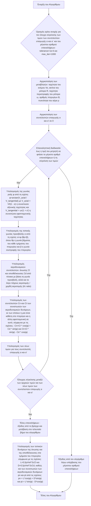

```mermaid

flowchart TD
    A[Έναρξη του Αλγορίθμου] --> B{Ορισμός ορίου ανοχής για τον έλεγχο σύγκλισης των τιμών των συντελεστών επαγωγής α και α΄ και του μέγιστου αριθμού επαναλήψεων: tolerance=1e-6 και max_iter=1000}
    B --> C[Αρχικοποίηση των μεταβλητών: ταχύτητα του ανέμου Vo, ακτίνα του ρότορα R, ταχύτητα περιστροφής του ρότορα ω, αριθμός πτερυγίων B, πυκνότητα του αέρα ρ]
    C --> D[Αρχικοποίηση των συντελεστών επαγωγής α και α' σε 0]
    D --> E{Επαναληπτική διαδικασία έως η τιμή του μετρητή να φτάσει το μέγιστο αριθμό επαναλήψεων ή τη σύγκλιση των τιμών}
    E -->|Ναι|F["Υπολογισμός της γωνίας ροής φ από τη σχέση: φ=arctan(V_axial / V_tangential) με V_axial = V0(1 - α) η συνιστώσα αξονικής ταχύτητας και V_tangential = ωr(1 + α') η συνιστώσα εφαπτομενικής ταχύτητας"]
    F --> G["Υπολογισμός της τοπικής γωνίας προσβολής α από τη σχέση: α=φ-(θp+β), όπου θp η γωνία βήματος του κάθε τμήματος του πτερυγίου και β η γωνία συστροφής του πτερυγίου"]
    G --> H["Υπολογισμός αεροδυναμικών συντελεστών: άνωσης Cl και οπισθέλκουσας Cd από πίνακα με βάση τη γωνία προσβολή, αλλά και το λόγο πάχους αεροτομής / χορδή αεροτομής (t/c ratio)"]
    H --> I["Υπολογισμός των συντελεστών Cn και Ct των συνιστωσών των αεροδυναμικών δυνάμεων, εκ των οποίων η μια είναι κάθετη στο πτερύγιο και η άλλη εφαπτομενική σε αυτό, σύμφωνα με τις σχέσεις : Cn=Cl * cos(φ) + Cd * sin(φ) και Ct=Cl * sin(φ) - Cd * cos(φ)"]
    I --> J[Υπολογισμός των νέων τιμών για τους συντελεστές επαγωγής α και α']
    J --> K{Έλεγχος σύγκλισης μεταξύ των αρχικών τιμών και των νέων τιμών των συντελεστών επαγωγής α και α'}
    K -->|Ναι|L[Τέλος επαναλήψεων - έξοδος από το βρόγχο και μετάβαση στο τελευταίο βήμα του αλγορίθμου]
    L -->M["Υπολογισμός των τοπικών δυνάμεων της άνωσης και της οπισθέλκουσας στα τμήματα του πτερυγίου σύμφωνα με τις σχέσεις: L=0,5ρVrel^2cCl και D=0,5ρVrel^2cCd, καθώς και των συνιστωσών των αεροδυναμικών δυνάμεων pn και pt από τις σχέσεις: pn = L*cos(φ) + D*sin(φ) και pt = L*sin(φ) - D*cos(φ)"]
    K -->|Όχι|E
    E -->|Όχι|N[Έξοδος από τον αλγόριθμο λόγω υπέρβασης του μέγιστου αριθμού επαναλήψεων]
    M --> O[Τέλος του Αλγορίθμου]
    N --> O


```
