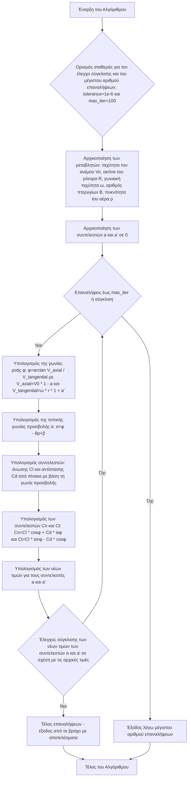

```mermaid

flowchart TD
    A[Έναρξη του Αλγόριθμου] --> B{Ορισμός σταθεράς για τον έλεγχο σύγκλισης και του μέγιστου αριθμού επαναλήψεων: tolerance=1e-6 και max_iter=100}
    B --> C[Αρχικοποίηση των μεταβλητών: ταχύτητα του ανέμου Vo, ακτίνα του ρότορα R, γωνιακή ταχύτητα ω, αριθμός πτερυγίων B, πυκνότητα του αέρα ρ]
    C --> D[Αρχικοποίηση των συντελεστών a και a' σε 0]
    D --> E{Επαναλήψεις έως max_iter ή σύγκλιση}
    E -->|Ναι|F[Υπολογισμός της γωνίας ροής φ: φ=arctan V_axial / V_tangential με V_axial=V0 * 1 - a και V_tangential=ω * r * 1 + a']
    F --> G[Υπολογισμός της τοπικής γωνίας προσβολής α: α=φ - θp+β]
    G --> H[Υπολογισμός συντελεστών: άνωσης Cl και αντίστασης Cd από πίνακα με βάση τη γωνία προσβολής]
    H --> I[Υπολογισμός των συντελεστών Cn και Ct: Cn=Cl * cosφ + Cd * siφ και Ct=Cl * sinφ - Cd * cosφ]
    I --> J[Υπολογισμός των νέων τιμών για τους συντελεστές a και a']
    J --> K{Έλεγχος σύγκλισης των νέων τιμών των συντελεστών a και a' σε σχέση με τις αρχικές τιμές}
    K -->|Ναι|L[Τέλος επαναλήψεων - έξοδος από το βρόχο με αποτελέσματα]
    K -->|Όχι|E
    E -->|Όχι|M[Έξοδος λόγω μέγιστου αριθμού επαναλήψεων]
    L --> N[Τέλος του Αλγόριθμου]
    M --> N


```